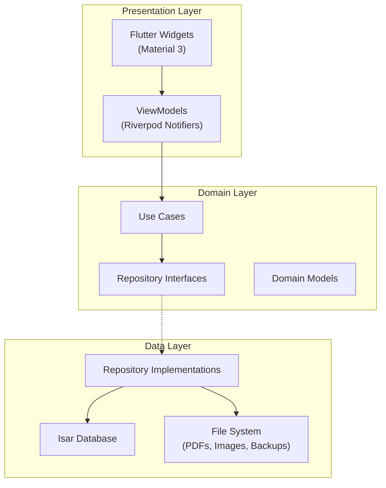
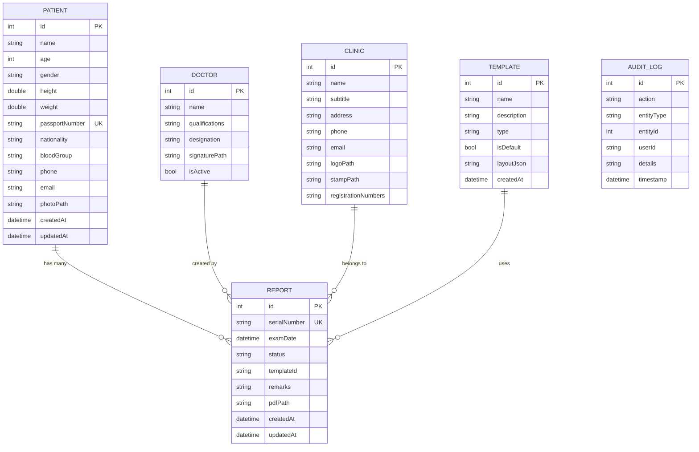

# Enterprise Medical Report Management System — Implementation Plan

## Overview

Build a **production-grade Flutter Desktop application** (Windows-first) for medical clinics to generate, manage, print, and export Occupational Health Reports matching the **Shanti Clinic GAMCA-style** format from the uploaded reference image.

The system replaces manual PDF form-filling with a **smart form → PDF pipeline**, supports dynamic report templates, patient management, and full enterprise workflow.

> [!IMPORTANT]
> **This is a massive enterprise project.** To deliver a working, high-quality application rather than a half-built skeleton, the plan is structured into **6 phases** delivered incrementally. Each phase produces a functional, testable application.

---

## Technology Stack Confirmation

| Technology | Package / Version | Status |
|---|---|---|
| Framework | Flutter Desktop (Windows) | ✅ Stable |
| State Management | `flutter_riverpod ^2.6.1` | ✅ Active |
| Routing | `go_router ^14.8.0` | ✅ Active |
| Database | `isar ^3.1.0+1` | ⚠️ Works but unmaintained — abstracted behind repository |
| PDF Generation | `pdf ^3.11.2` | ✅ Active |
| Printing | `printing ^5.13.5` | ✅ Active |
| Excel Export | `excel ^4.0.6` | ✅ Active |
| Fonts | `google_fonts ^6.2.1` | ✅ Active |
| Window Management | `window_manager ^0.4.3` | ✅ Active |
| QR/Barcode | `qr_flutter ^4.1.0` + `barcode_widget ^2.0.4` | ✅ Active |
| File Picker | `file_picker ^8.1.7` | ✅ Active |
| Responsive | `responsive_framework ^1.5.1` | ✅ Active |
| Architecture | Clean Architecture / MVVM + Repository Pattern | — |

> [!WARNING]
> **Isar Risk**: Isar v3 is unmaintained (last update 2+ years ago). It works on Windows Desktop today, but may break with future Flutter versions. The entire data layer is built behind a **repository abstraction** so it can be swapped to ObjectBox or Drift if needed, without touching UI or business logic.

---

## User Review Required

> [!IMPORTANT]
> **Phase Strategy**: This plan covers 6 phases. I recommend building **Phase 1–3 first** (core app with report generation, PDF, and patient management). Phases 4–6 add advanced features (template builder, audit logs, roles). Do you want all 6 phases, or should I focus on Phases 1–3 first?

> [!IMPORTANT]
> **Report Format**: The PDF layout will be modeled pixel-for-pixel after the uploaded Shanti Clinic report. The clinic-specific text (name, address, registration numbers) will be stored in Settings and be fully configurable — not hardcoded.

> [!IMPORTANT]
> **Isar vs. Alternatives**: You specified "Only Isar. No SQLite. No Hive." I will proceed with Isar but behind a repository abstraction. If you encounter issues with future Flutter updates, the database can be swapped without rewriting the app. Are you comfortable with this risk?

---

## Open Questions

> [!IMPORTANT]
> 1. **Multi-language support**: You mentioned "Language" in Settings. Which languages should be supported initially? English only, or also Hindi/Gujarati?
> 2. **User authentication**: Should there be a login screen with password, or is it a single-user desktop app initially?
> 3. **Report numbering**: Should serial numbers auto-increment per year (e.g., 2025/0001) or globally?
> 4. **Photo capture**: Should the app support webcam capture for patient photos, or only file upload?
> 5. **Clinic branding**: Should the header match the exact Shanti Clinic layout, or should it be a generic template where any clinic can plug in their details?

---

## Proposed Architecture



---

## Project Folder Structure

```
d:\DB vaghela\medical_report_system\
├── lib/
│   ├── main.dart
│   ├── app.dart                          # MaterialApp + GoRouter + Theme
│   │
│   ├── core/
│   │   ├── config/
│   │   │   ├── app_config.dart           # App constants, version
│   │   │   └── route_config.dart         # GoRouter route definitions
│   │   ├── theme/
│   │   │   ├── app_theme.dart            # Light/Dark ThemeData
│   │   │   ├── app_colors.dart           # Enterprise color palette
│   │   │   ├── app_typography.dart       # Typography scale
│   │   │   └── theme_extensions.dart     # Custom ThemeExtensions
│   │   ├── database/
│   │   │   ├── isar_database.dart        # Isar initialization & instance
│   │   │   ├── database_service.dart     # Backup, restore, health check
│   │   │   └── collections/             # All Isar collection schemas
│   │   │       ├── patient_collection.dart
│   │   │       ├── report_collection.dart
│   │   │       ├── template_collection.dart
│   │   │       ├── doctor_collection.dart
│   │   │       ├── clinic_collection.dart
│   │   │       ├── settings_collection.dart
│   │   │       ├── lab_test_collection.dart
│   │   │       ├── medical_section_collection.dart
│   │   │       ├── company_collection.dart
│   │   │       ├── audit_log_collection.dart
│   │   │       ├── user_collection.dart
│   │   │       └── attachment_collection.dart
│   │   ├── repositories/
│   │   │   ├── base_repository.dart      # Generic CRUD interface
│   │   │   ├── patient_repository.dart   # Interface + Isar implementation
│   │   │   ├── report_repository.dart
│   │   │   ├── template_repository.dart
│   │   │   ├── doctor_repository.dart
│   │   │   ├── settings_repository.dart
│   │   │   ├── master_data_repository.dart
│   │   │   ├── audit_log_repository.dart
│   │   │   └── user_repository.dart
│   │   ├── models/
│   │   │   ├── patient.dart              # Domain model (not Isar-specific)
│   │   │   ├── report.dart
│   │   │   ├── template.dart
│   │   │   ├── doctor.dart
│   │   │   ├── clinic.dart
│   │   │   ├── medical_exam.dart         # Embedded: eye, ear, systemic
│   │   │   ├── lab_investigation.dart    # Embedded: blood, urine, serology
│   │   │   ├── report_field.dart         # Dynamic field definition
│   │   │   └── audit_log.dart
│   │   ├── services/
│   │   │   ├── pdf_service.dart          # PDF generation engine
│   │   │   ├── print_service.dart        # Printing wrapper
│   │   │   ├── excel_service.dart        # Excel export engine
│   │   │   ├── backup_service.dart       # Backup & restore
│   │   │   ├── search_service.dart       # Universal search
│   │   │   ├── image_service.dart        # Image handling, compression
│   │   │   └── file_service.dart         # File I/O utilities
│   │   ├── providers/
│   │   │   ├── database_providers.dart   # Isar instance provider
│   │   │   ├── repository_providers.dart # All repository providers
│   │   │   ├── service_providers.dart    # All service providers
│   │   │   └── theme_provider.dart       # Theme mode provider
│   │   └── utils/
│   │       ├── extensions.dart           # Dart extensions
│   │       ├── validators.dart           # Form validators
│   │       ├── formatters.dart           # Date, number formatters
│   │       ├── constants.dart            # String constants
│   │       └── keyboard_shortcuts.dart   # Global shortcuts
│   │
│   ├── features/
│   │   ├── shell/
│   │   │   ├── app_shell.dart            # Navigation rail + app bar + content
│   │   │   ├── navigation_rail.dart      # Left nav rail (collapsible)
│   │   │   └── top_app_bar.dart          # Top bar with search, user, actions
│   │   │
│   │   ├── dashboard/
│   │   │   ├── views/
│   │   │   │   └── dashboard_page.dart
│   │   │   ├── widgets/
│   │   │   │   ├── stat_card.dart
│   │   │   │   ├── recent_activity.dart
│   │   │   │   ├── quick_actions.dart
│   │   │   │   └── charts/
│   │   │   │       ├── reports_by_month_chart.dart
│   │   │   │       ├── blood_group_chart.dart
│   │   │   │       └── age_distribution_chart.dart
│   │   │   └── providers/
│   │   │       └── dashboard_provider.dart
│   │   │
│   │   ├── reports/
│   │   │   ├── views/
│   │   │   │   ├── generate_report_page.dart   # Main report form
│   │   │   │   ├── report_preview_page.dart    # PDF preview
│   │   │   │   └── report_detail_page.dart     # View existing report
│   │   │   ├── widgets/
│   │   │   │   ├── patient_info_form.dart       # Left panel: patient details
│   │   │   │   ├── medical_exam_form.dart       # Medical examination form
│   │   │   │   ├── lab_investigation_form.dart  # Lab tests form
│   │   │   │   ├── report_header_preview.dart   # Live header preview
│   │   │   │   └── field_widgets/
│   │   │   │       ├── result_field.dart         # Normal/Abnormal/NAD
│   │   │   │       ├── lab_value_field.dart      # Numeric with unit + reference
│   │   │   │       └── elisa_result_field.dart   # Reactive/Non-Reactive
│   │   │   └── providers/
│   │   │       ├── report_form_provider.dart
│   │   │       └── report_list_provider.dart
│   │   │
│   │   ├── patients/
│   │   │   ├── views/
│   │   │   │   ├── patients_list_page.dart
│   │   │   │   └── patient_detail_page.dart
│   │   │   ├── widgets/
│   │   │   │   ├── patient_form.dart
│   │   │   │   ├── patient_history.dart
│   │   │   │   └── patient_search.dart
│   │   │   └── providers/
│   │   │       └── patient_provider.dart
│   │   │
│   │   ├── history/
│   │   │   ├── views/
│   │   │   │   └── report_history_page.dart
│   │   │   ├── widgets/
│   │   │   │   ├── history_filters.dart
│   │   │   │   ├── history_table.dart
│   │   │   │   └── history_actions.dart
│   │   │   └── providers/
│   │   │       └── history_provider.dart
│   │   │
│   │   ├── templates/
│   │   │   ├── views/
│   │   │   │   ├── template_list_page.dart
│   │   │   │   └── template_builder_page.dart    # Dynamic report builder
│   │   │   ├── widgets/
│   │   │   │   ├── section_editor.dart
│   │   │   │   ├── field_editor.dart
│   │   │   │   ├── layout_editor.dart
│   │   │   │   └── template_preview.dart
│   │   │   └── providers/
│   │   │       └── template_provider.dart
│   │   │
│   │   ├── master_data/
│   │   │   ├── views/
│   │   │   │   └── master_data_page.dart         # Tabbed: doctors, clinics, etc.
│   │   │   ├── widgets/
│   │   │   │   ├── master_data_table.dart
│   │   │   │   └── master_data_form.dart
│   │   │   └── providers/
│   │   │       └── master_data_provider.dart
│   │   │
│   │   ├── settings/
│   │   │   ├── views/
│   │   │   │   └── settings_page.dart
│   │   │   ├── widgets/
│   │   │   │   ├── company_settings.dart
│   │   │   │   ├── print_settings.dart
│   │   │   │   ├── theme_settings.dart
│   │   │   │   └── backup_settings.dart
│   │   │   └── providers/
│   │   │       └── settings_provider.dart
│   │   │
│   │   ├── backup/
│   │   │   ├── views/
│   │   │   │   └── backup_page.dart
│   │   │   └── providers/
│   │   │       └── backup_provider.dart
│   │   │
│   │   └── auth/
│   │       ├── views/
│   │       │   └── login_page.dart
│   │       └── providers/
│   │           └── auth_provider.dart
│   │
│   └── shared/
│       └── widgets/
│           ├── app_card.dart                 # Rounded enterprise card
│           ├── app_data_table.dart            # Professional data table
│           ├── app_search_bar.dart            # Floating search
│           ├── app_dialog.dart                # Confirmation dialogs
│           ├── app_loading.dart               # Loading skeletons
│           ├── app_empty_state.dart           # Empty state illustrations
│           ├── app_status_badge.dart          # Status chips
│           ├── app_photo_picker.dart          # Photo upload widget
│           ├── app_breadcrumb.dart            # Breadcrumb navigation
│           └── app_context_menu.dart          # Right-click menu
│
├── assets/
│   ├── fonts/                                # Bundled fonts
│   ├── images/                               # Default logos, placeholders
│   └── icons/                                # Custom icons
│
├── test/
│   ├── unit/
│   ├── widget/
│   └── integration/
│
├── pubspec.yaml
├── analysis_options.yaml
└── README.md
```

---

## Isar Database Schema

### Collections & Embedded Objects



### Embedded Objects (stored inline within Report)

| Object | Fields |
|---|---|
| `PatientInfo` | name, age, gender, height, weight, passportNo, nationality, bloodGroup, position, visaNo, issueDate, placeOfIssue, photo |
| `MedicalExam` | eyeRight, eyeLeft, earRight, earLeft, cardiovascular, bp, heart, respiratory, chestXRay, tuberculosis, gastro, abdomen, hernia, varicoseVeins, extremities, deformities, skin, venrealDiseases, clinicalRemarks |
| `LabInvestigation` | urineSugar, urineAlbumin, bilharziasis, stool (all fields), blood (all fields), serology (all fields), lipidProfile (all fields), elisa (all fields) |
| `ReportMetadata` | serialNumber, examDate, doctorId, clinicId, templateId, status, remarks |

---

## Phased Implementation Plan

---

### Phase 1: Foundation & Core Architecture
**Estimated effort: ~2500 lines of code**

> Sets up the entire project skeleton, database, theme, navigation, and shared widgets. After this phase, you have a running app with navigation and enterprise UI shell.

#### [NEW] Project initialization
- Flutter project creation with Windows desktop target
- `pubspec.yaml` with all dependencies
- `analysis_options.yaml` with strict lint rules

#### [NEW] [app_config.dart](file:///d:/DB%20vaghela/medical_report_system/lib/core/config/app_config.dart)
- App name, version, build constants
- Default paths for PDFs, backups, images

#### [NEW] [app_theme.dart](file:///d:/DB%20vaghela/medical_report_system/lib/core/theme/app_theme.dart)
- Material 3 ThemeData (light + dark)
- Enterprise blue/gray palette: Primary `#1565C0`, Surface `#FAFBFC`, Card `#FFFFFF`
- `Inter` font family (bundled)
- Custom ThemeExtensions for enterprise-specific styling

#### [NEW] [app_colors.dart](file:///d:/DB%20vaghela/medical_report_system/lib/core/theme/app_colors.dart)
- Full color system: primary, secondary, surface, error, success, warning, info
- Chart colors, status colors, severity colors

#### [NEW] [app_typography.dart](file:///d:/DB%20vaghela/medical_report_system/lib/core/theme/app_typography.dart)
- Typography scale using Inter: display, headline, title, body, label
- Enterprise font weights and sizes

#### [NEW] Isar Database Setup
- `isar_database.dart` — Singleton initialization with all collections
- All 12 collection schemas (Patient, Report, Template, Doctor, Clinic, Settings, LabTest, MedicalSection, Company, AuditLog, User, Attachment)
- Indexes on: patient name, passport number, report serial number, date, doctor, company, status

#### [NEW] Repository Layer
- `base_repository.dart` — Generic CRUD interface (`findAll`, `findById`, `create`, `update`, `delete`, `watch`)
- Concrete implementations for each collection
- Repository providers via Riverpod

#### [NEW] [app_shell.dart](file:///d:/DB%20vaghela/medical_report_system/lib/features/shell/app_shell.dart)
- Shell layout: NavigationRail (left) + TopAppBar (top) + Content (center)
- Collapsible rail with icons + labels
- All 9 navigation destinations

#### [NEW] [navigation_rail.dart](file:///d:/DB%20vaghela/medical_report_system/lib/features/shell/navigation_rail.dart)
- Animated collapse/expand
- Active indicator with Material 3 styling
- Icons for each destination

#### [NEW] [top_app_bar.dart](file:///d:/DB%20vaghela/medical_report_system/lib/features/shell/top_app_bar.dart)
- Current page title (breadcrumb)
- Universal search bar
- Quick action buttons: Print, Export, Dark Mode toggle
- User avatar + notification bell

#### [NEW] [route_config.dart](file:///d:/DB%20vaghela/medical_report_system/lib/core/config/route_config.dart)
- GoRouter with ShellRoute for navigation rail
- Routes for all 9 main sections + sub-routes

#### [NEW] Shared Widgets (10 widgets)
- `AppCard` — Rounded card with subtle shadow, hover effect
- `AppDataTable` — Sortable, filterable data table with pagination
- `AppSearchBar` — Floating search with debounce
- `AppDialog` — Confirmation/info dialogs
- `AppLoading` — Shimmer/skeleton loading
- `AppEmptyState` — Illustrated empty states
- `AppStatusBadge` — Color-coded status chips (FIT, UNFIT, PENDING)
- `AppPhotoPicker` — Image upload with preview
- `AppBreadcrumb` — Breadcrumb navigation
- `AppContextMenu` — Right-click context menu

#### [NEW] [main.dart](file:///d:/DB%20vaghela/medical_report_system/lib/main.dart)
- Window configuration (min size 1200x800, title)
- Isar initialization
- ProviderScope
- MaterialApp.router with GoRouter

---

### Phase 2: Report Generation & PDF Engine
**Estimated effort: ~3000 lines of code**

> The core value proposition. Smart form → PDF generation matching the uploaded Shanti Clinic format pixel-for-pixel.

#### [NEW] [generate_report_page.dart](file:///d:/DB%20vaghela/medical_report_system/lib/features/reports/views/generate_report_page.dart)
- Split layout: Left panel (Patient Info) + Right panel (Medical Exam + Lab)
- Tabbed sections: Patient Info → Medical Exam → Lab Investigation → Review
- Auto-save draft every 30 seconds
- Toolbar: Save, Preview, Print, Export, Reset

#### [NEW] [patient_info_form.dart](file:///d:/DB%20vaghela/medical_report_system/lib/features/reports/widgets/patient_info_form.dart)
- All patient fields from the report format:
  - Name, Age, Gender, Height, Weight, Passport No, Nationality, Position, Visa No, Issue Date, Place of Issue, Blood Group, Photo
- Patient search/autocomplete (reuse existing patient)
- Auto-calculate age from date of birth
- Auto-fill from previous reports

#### [NEW] [medical_exam_form.dart](file:///d:/DB%20vaghela/medical_report_system/lib/features/reports/widgets/medical_exam_form.dart)
- Sections matching the report:
  - **Eye**: R.EYE / L.EYE with Normal/Abnormal dropdown + notes
  - **Ear**: R.EAR / L.EAR with NAD/Abnormal
  - **Systemic Exam**: Cardiovascular (BP, Heart), Respiratory, Chest X-Ray, Tuberculosis, Gastro Intestinal, Abdomen, Hernia, Varicose Veins, Extremities, Deformities, Skin, Venereal Diseases, Clinical
- Each field: Dropdown (Normal/NAD/Abnormal/NIL/ABSENT) + optional notes TextField
- "Set All Normal" quick action button
- Color indicators: Green (normal), Red (abnormal), Gray (not examined)

#### [NEW] [lab_investigation_form.dart](file:///d:/DB%20vaghela/medical_report_system/lib/features/reports/widgets/lab_investigation_form.dart)
- Sections matching the report:
  - **Urine**: Sugar, Albumin, Bilharziasis
  - **Stool Routine**: OVA, Cyst, Blood, Helminthes, Giardia, Bilharziasis, Salmonella, Shigella, V.Cholera
  - **Blood**: Hemoglobin, TLC, WBC, ESR, SGPT, Blood Urea, S-Uric Acid, Malaria, Micro Filaria
  - **Serology**: PP2BS, FBS, LFT, Creatinine, Platelet Count
  - **Lipid Profile**: S-CHO, TRY, HDL, LDL, G6PD
  - **ELISA**: HIV 1&2, Hbs Ag%, Anti HCV%, VDRL, TPHA
- Numeric fields with unit labels and reference ranges
- Out-of-range highlighting (red border + warning icon)
- ELISA fields: Dropdown (Negative/Positive/Reactive/Non-Reactive)

#### [NEW] Custom field widgets
- `result_field.dart` — Dropdown for Normal/NAD/Abnormal with color indicator
- `lab_value_field.dart` — Number input + unit + reference range + out-of-range warning
- `elisa_result_field.dart` — Dropdown with color-coded results

#### [NEW] [pdf_service.dart](file:///d:/DB%20vaghela/medical_report_system/lib/core/services/pdf_service.dart)
- **Pixel-perfect reproduction** of the uploaded Shanti Clinic report format
- Layout structure:
  1. **Header band**: Clinic logo (left) + Clinic name, qualifications, address, phone (center) + Registration numbers (right)
  2. **"MEDICAL REPORT" title** centered
  3. **Patient info table**: 2-column grid with all patient fields
  4. **Three-column body table**:
     - Col 1: "MEDICAL EXAMINATION" — Type + Results
     - Col 2: "TYPE OF INVESTIGATIONS" — Test categories + test names
     - Col 3: "LABORATORY INVESTIGATION RESULTS" — Values
  5. **Footer**: Doctor stamp (left) + Signature (right) + "Authorised Signatory"
- Features: Embedded fonts, clinic logo, doctor signature, stamp image, QR code, barcode, page numbers, watermark
- Background PDF generation via `Isolate`

#### [NEW] [print_service.dart](file:///d:/DB%20vaghela/medical_report_system/lib/core/services/print_service.dart)
- Preview before printing
- Printer selection
- Paper size (A4, Letter, custom)
- Margins, orientation
- Multiple copies
- Silent print option

#### [NEW] [report_preview_page.dart](file:///d:/DB%20vaghela/medical_report_system/lib/features/reports/views/report_preview_page.dart)
- Full PDF preview using `printing` package's `PdfPreview`
- Toolbar: Print, Save PDF, Export Excel, Email, Share
- Zoom controls
- Page navigation (for multi-page reports)

#### [NEW] Report form providers
- `report_form_provider.dart` — StateNotifier managing form state, validation, auto-save
- `report_list_provider.dart` — AsyncNotifier for report CRUD operations

---

### Phase 3: Patient Management, History & Excel Export
**Estimated effort: ~2000 lines of code**

> Complete patient lifecycle + report history + Excel export.

#### [NEW] Patient Management
- `patients_list_page.dart` — Data table with search, sort, filter
- `patient_detail_page.dart` — Profile view with history, reports, documents
- `patient_form.dart` — Create/edit patient dialog
- `patient_search.dart` — Autocomplete search widget
- Merge duplicate patients feature
- Upload patient photo

#### [NEW] Report History
- `report_history_page.dart` — Advanced data table
- Filters: Date range, Doctor, Patient, Passport, Blood Group, Status
- Sort by any column
- Actions per report: Preview, Edit, Duplicate, Delete, Export, Print
- Bulk actions: Export selected, Delete selected

#### [NEW] [excel_service.dart](file:///d:/DB%20vaghela/medical_report_system/lib/core/services/excel_service.dart)
- Export to `.xlsx` with columns: Patient Details, Medical Results, Lab Results, Doctor, Date, Status, Report Number
- Export modes: Selected reports, Date range, All
- Auto-formatting: headers, column widths, colors
- Sheet per category option

#### [NEW] [search_service.dart](file:///d:/DB%20vaghela/medical_report_system/lib/core/services/search_service.dart)
- Universal search across: Patient name, Passport, Doctor, Report number, Company, Position
- Debounced, indexed search via Isar
- Search result grouping by entity type

---

### Phase 4: Dashboard, Master Data & Settings
**Estimated effort: ~2000 lines of code**

> Analytics dashboard + all configurable master data + app settings.

#### [NEW] Dashboard
- `dashboard_page.dart` — Grid of stat cards + charts + quick actions
- **Stat Cards**: Today's Reports, Month Reports, Total Reports, Pending Reports
- **Charts** (using `fl_chart` package):
  - Reports by Month (bar chart)
  - Reports by Doctor (pie chart)
  - Blood Group Distribution (donut chart)
  - Age Distribution (histogram)
- **Recent Activity**: Last 10 actions (created, edited, printed)
- **Quick Actions**: Generate Report, Create Patient, Print Last, Export Excel, Open History

#### [NEW] Master Data
- `master_data_page.dart` — Tabbed interface for all configurable data:
  - Doctors (name, qualification, signature)
  - Clinics (name, address, logo, stamp)
  - Blood Groups
  - Diseases / Conditions
  - Lab Tests (name, unit, reference range, category)
  - Report Sections & Headings
  - Dropdown Values (for all dropdowns)
  - Countries, Positions, Visa Types, Companies
- CRUD for each entity with inline editing
- Import/export master data

#### [NEW] Settings
- `settings_page.dart` — Grouped settings:
  - **Company/Clinic**: Name, address, logo, stamp, signature, registration numbers
  - **Theme**: Light/Dark mode, accent color
  - **Font**: Font family, size scale
  - **Print**: Default printer, paper size, margins, auto-print
  - **Auto-numbering**: Serial number format, reset period
  - **Backup**: Auto-backup interval, backup path
  - **Database**: Database path, database size info
  - **PDF**: Default save path, quality settings

---

### Phase 5: Template Builder & Backup System
**Estimated effort: ~2500 lines of code**

> Dynamic report template builder + full backup/restore system.

#### [NEW] Template Management
- `template_list_page.dart` — List all templates with preview thumbnails
- Template types: GAMCA, Occupational, Hospital, Company Medical, Visa Medical
- Actions: Duplicate, Import, Export (JSON), Delete, Set Default, Preview

#### [NEW] Dynamic Report Builder
- `template_builder_page.dart` — Visual editor for report templates
- **Section Management**:
  - Add/remove/rename/reorder sections (drag & drop)
  - Toggle section visibility
- **Field Management**:
  - Add/remove/rename fields within sections
  - Change field type (text, number, dropdown, checkbox, radio)
  - Set default values, dropdown options
  - Set reference ranges for lab values
- **Layout Customization**:
  - Font family, size, alignment per section
  - Border styles
  - Column widths
  - Margins, padding
- **Branding**:
  - Upload/change logo, signature, stamp
  - Watermark text/image
  - Header/footer content
- **Page Settings**:
  - Page size (A4, Letter, Legal, custom)
  - Orientation (Portrait, Landscape)
  - Multi-page support
- **Live Preview**: Real-time PDF preview as changes are made
- Template stored as JSON in Isar

#### [NEW] Backup & Restore
- `backup_page.dart`
- **Manual Backup**: One-click backup to selected folder
- **Auto Backup**: Configurable interval (daily, weekly)
- **Restore**: Select backup file → preview → restore
- **Import/Export Database**: Full Isar database file
- **Database Health**: Collection counts, file size, integrity check

---

### Phase 6: User Roles, Audit Logs & Smart Features
**Estimated effort: ~2000 lines of code**

> Enterprise security, compliance, and productivity features.

#### [NEW] User Management & Roles
- `login_page.dart` — Simple local login (username + password hash)
- Roles: Admin, Doctor, Receptionist, Operator, Viewer
- Permission matrix: Which roles can access which features
- User CRUD (Admin only)

#### [NEW] Audit Logs
- `audit_log_page.dart` — Searchable log of all system activity
- Events tracked: Create, Edit, Delete, Print, Export, Login, Logout, Settings Change, Template Change
- Fields: User, Action, Entity, Timestamp, Details
- Filter by date range, user, action type
- Export audit log

#### [NEW] Smart Features
- **Auto-save**: Draft reports saved every 30s
- **Undo/Redo**: Form-level undo/redo stack
- **Keyboard Shortcuts**: Ctrl+N (new report), Ctrl+P (print), Ctrl+S (save), Ctrl+F (search), Ctrl+E (export)
- **Duplicate Previous Report**: Copy all fields from a previous report for a patient
- **Recently Used Patients**: Quick-access list
- **Pinned Reports**: Pin important reports to dashboard
- **Draft Reports**: Save incomplete reports as drafts
- **Auto Serial Number**: Configurable format with auto-increment

---

## Enterprise UI Design Specifications

### Color Palette

| Token | Light Mode | Dark Mode | Usage |
|---|---|---|---|
| Primary | `#1565C0` | `#90CAF9` | Nav rail active, buttons, links |
| Primary Container | `#E3F2FD` | `#1A237E` | Active nav background, selected row |
| Surface | `#FAFBFC` | `#121212` | Main background |
| Card | `#FFFFFF` | `#1E1E1E` | Cards, panels |
| On Surface | `#1A1A1A` | `#E0E0E0` | Primary text |
| On Surface Variant | `#5F6368` | `#9AA0A6` | Secondary text |
| Outline | `#E0E0E0` | `#303030` | Borders, dividers |
| Success | `#2E7D32` | `#81C784` | Normal/FIT results |
| Error | `#C62828` | `#EF9A9A` | Abnormal/UNFIT results |
| Warning | `#F57F17` | `#FFD54F` | Pending, out-of-range |

### Typography (Inter font family)

| Style | Size | Weight | Usage |
|---|---|---|---|
| Display Large | 32px | 700 | Dashboard title |
| Headline Medium | 24px | 600 | Page titles |
| Title Large | 20px | 600 | Section headers |
| Title Medium | 16px | 600 | Card titles |
| Body Large | 16px | 400 | Primary content |
| Body Medium | 14px | 400 | Form labels, table cells |
| Body Small | 12px | 400 | Captions, timestamps |
| Label Large | 14px | 500 | Buttons, tabs |

### Component Specs

| Component | Specification |
|---|---|
| Navigation Rail | Width: 72px collapsed / 256px expanded. Blue active indicator. |
| Cards | Border radius: 12px. Elevation: 1. Hover elevation: 2. |
| Data Tables | Alternating row colors. Sortable headers. Row hover highlight. |
| Buttons | Height: 40px. Border radius: 8px. Ripple effect. |
| Input Fields | Height: 48px. Border radius: 8px. Focus border: Primary. |
| Dialogs | Width: 480px. Border radius: 16px. Backdrop blur. |
| Status Badges | Height: 24px. Border radius: 12px. Color-coded. |

---

## Verification Plan

### Automated Tests
```bash
# Unit tests for repositories and services
flutter test test/unit/

# Widget tests for form components
flutter test test/widget/

# Integration tests for report generation flow
flutter test integration_test/
```

### Manual Verification
1. **Report Generation Flow**: Create a report → fill all fields → preview PDF → verify it matches the uploaded Shanti Clinic format
2. **PDF Quality**: Print generated PDF → compare with original report image
3. **Database Operations**: Create 1000+ test reports → verify search/filter performance
4. **Backup/Restore**: Create backup → delete data → restore → verify integrity
5. **Theme**: Toggle dark mode → verify all screens render correctly
6. **Navigation**: Verify all 9 navigation destinations load correctly
7. **Excel Export**: Export reports → open in Excel → verify data accuracy

---

## Delivery Summary

| Phase | Deliverable | Dependencies |
|---|---|---|
| **Phase 1** | Running app with navigation, theme, database, shared widgets | None |
| **Phase 2** | Report generation form + PDF engine + printing | Phase 1 |
| **Phase 3** | Patient management + report history + Excel export | Phase 2 |
| **Phase 4** | Dashboard + master data + settings | Phase 3 |
| **Phase 5** | Template builder + backup system | Phase 4 |
| **Phase 6** | User roles + audit logs + smart features | Phase 5 |

> [!TIP]
> **Recommendation**: Start with Phases 1–3 to get a functional MVP that can generate, print, and manage medical reports. Phases 4–6 add enterprise polish. Each phase is independently testable and delivers incremental value.

---

## Risk Mitigation

| Risk | Mitigation |
|---|---|
| Isar unmaintained | Repository abstraction pattern — swap to ObjectBox/Drift without touching UI |
| Complex PDF layout | Iterative approach — build table-by-table, compare with reference image |
| Template builder complexity | JSON-based template schema — gradual feature addition |
| Performance with 100K+ reports | Isar indexes + pagination + lazy loading |
| Flutter Desktop Windows quirks | `window_manager` for window control, thorough testing on Windows 10/11 |
